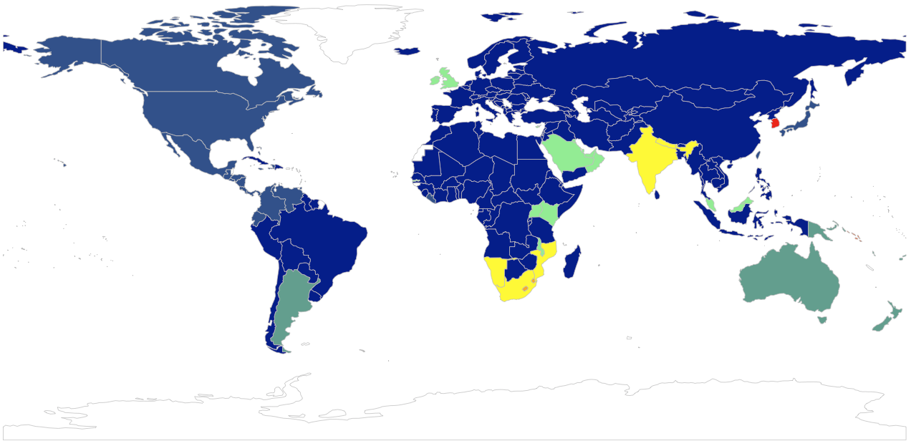

## Electrical Sockets Clustering

A simple *Shiny* application that allows to interactively group countries in clusters based on the electrical sockets available respectively. Clustering is done using **Hierarchical Clustering**.

A more in depth description of the method can be found on my [blog](https://cosminsanda.com/posts/hierarchical-clustering-of-electrical-sockets/).